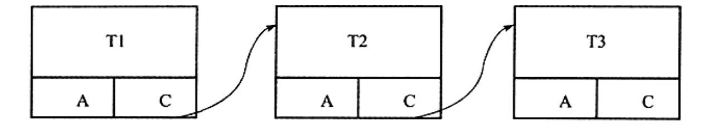
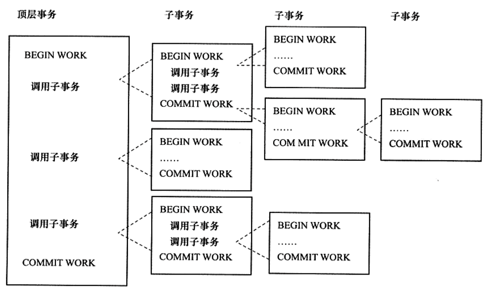

事务是数据库系统和文件系统最重要的区别之一。引入事务最重要的目的是： 事务会把数据库从一种状态转移到另外一种状态，在数据库提交之后，数据库的修改要么全部提交，要么全部回滚。InnoDB 存储引擎完全支持事务的四大特性(ACID): 即 原子性、一致性、隔离性以及持久性。

<!--more-->
 
## 1、认识事务
事务可以由一条简单的SQL组成，也可以有多条SQL组成。事务是访问并更新数据库的数据项的一个程序执行单元，在事务中操作要么都完成，要不都不完成。理论上事务必须支持基本特定，即ACID。但是从实际上来说，一些数据库厂商为了支持不同特性或者有不同的考虑，并不会严格的遵守ACID，比如对于Oracle的默认数据隔离级别`READ_COMMITED` 而言，其就不完全遵守事物的隔离性。 一般情况下不完全遵守事务的特性，可以适当的带来性能上的提升，但是需要开发者在实际的生产过程中需要注意这些细节问题。

<a name="DGxvQ"></a>
## 2、事务的分类
<a name="pun2H"></a>
### 2.1 扁平事务
扁平事务是最简单的一种事务，要么全部成功，要么全部失败。在扁平事务中所有的操作都从`BEGIN/START TRANSACTION` 开始，到` COMMIT或者ROLLBACK`结束。在常见的OLTP(在线事务应用)的程序中，一般事务提交的比例占96%，事务混滚操作的占3% ，强制回滚的事务占1%
扁平事务的问题是不能提交一部分或者完成一部分。举个例子，比如一个人写作业，先写语文，数学，物理。当写到物理的时候发现物理的试卷拿错了，此时在扁平事务中就不应该回滚全部事务，应当回滚到开始写物理试卷的时候。

<a name="IeUQq"></a>
### 2.2 保存点事务

携带保存点的事务，支持不完全的回滚事务，可能是回滚事务的某个点上，如上例子的中的事务应该此类型的事务就比较应景。其操作逻辑如下

```sql
-- 开启事务
BEGIN;
UPDATE home_work SET 'status' = 'finished' WHERE name ='语文';
SAVEPOINT CHINESES;

UPDATE home_work SET 'status' = 'finished' WHERE name ='数学';
SAVEPOINT MATH;


UPDATE home_work SET 'status' = 'finished' WHERE name ='英语';
-- 假设出现异常，回滚到 'MATH' 点

ROLLBAKC 'MATH';
```


<a name="VOuif"></a>
### 2.3 链事务
链事务是一种特殊的带保存点的事务，其和上面的区别是，链事务只能回滚到最新的保存点中，不能回滚到任意的保存点。而且带有保存点的扁平事务，当发生系统崩溃时，所有的保存点都将消失，因为其保存点是易失的（volatile），而非持久的( persistent)。这意味着当进行恢复时，事务需要从开始处重新执行，而不能从最近的一个保存点继续执行。
但对于链事务而言在提交一个事务时，释放不需要的数据对象，将必要的处理上下文隐式地传给下一个要开始的事务，注意，提交事务操作和开始下一个事务操作将合并为一个原子操作。这意味着下一个事务将看到上一个事务的结果，就好像在一个事务中进行的一样。



<a name="rcdWm"></a>
### 2.3 嵌套事务
嵌套事务是一种事务树状结构，子树节点既可以是事务树，也可以是扁平事务。其由一个顶层事务控制着各个层次的事务。顶层事务之下嵌套的事务被称为子事务（subtransaction），其控制每一个局部的变换。


1. 处在叶子节点的事务为扁平事务处于根节点的事务称之为顶层事务，其他事务未子事务.
1. 事务的前驱节点称之为父事务，事务的下一层称之为子事务。
1. 子事务可以Commit或者Rollback ,但是其提交并不立即生效，而是当顶层事务提交后，才是真正的提交
1. 嵌套事务中任何一个事务回滚会引起其子事务也一起回滚，故其子事务只具备ACI(原子性，一致性以及隔离性) 并不具备D(持久性)


在Moss的理论中，实际的工作是交由叶子节点来完成的，即只有叶子节点的事务才能访问数据库、发送消息、获取其他类型的资源。而高层的事务仅负责逻辑控制，决定何时调用相关的子事务

<a name="uoqCz"></a>
### 2.4 分布式事务

分布式事务通常是一个在分布式环境下运行的扁平事务，因此需要根据数据所在位置访问网络中的不同节点。假设一个用户在ATM机进行银行的转账操作，例如持卡人从招商银行的储蓄卡转账10000元到工商银行的储蓄卡。在这种情况下，可以将ATM机视为节点A，招商银行的后台数据库视为节点B，工商银行的后台数据库视为C，这个转账的操作可分解为以下的步骤：
```
1. 节点A发出转账命令
2. 节点B执行储蓄卡中的余额值减去10000。
3. 节点C执行储蓄卡中的余额值加上10000
4. 节点A通知用户操作完成或者节点A通知用户操作失败。
```

这里需要使用分布式事务，因为节点A不能通过调用一台数据库就完成任务。其需要访问网络中两个节点的数据库，而在每个节点的数据库执行的事务操作又都是扁平的。对于分布式事务，其同样需要满足ACID特性，要么都发生，要么都失效。对于上述的例子，如果2)、3)步中任何一个操作失败，都会导致整个分布式事务回滚。若非这样，结果会非常可怕。

> 具体关于分布式事务的文章，可以浏览个人专栏的中 分布式系统的文章，里面会详细讲述分布式系统中分布式事务的相关细节和应用 [分布式系统  https://www.zhoutao123.com/page/book/12](https://www.zhoutao123.com/page/book/12)


<a name="tyaeH"></a>
## 3、 事务的实现方式
事务的隔离性通过锁实现的(即非锁定读). 事务的一致性，持久性以及原子性是通过redo Log & undo log 实现的。redo 日志用来保证原子性和持久性，undo日志用来保存事物的一致性。


