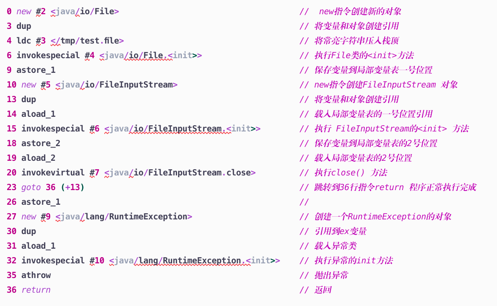
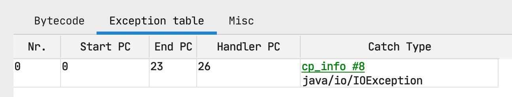
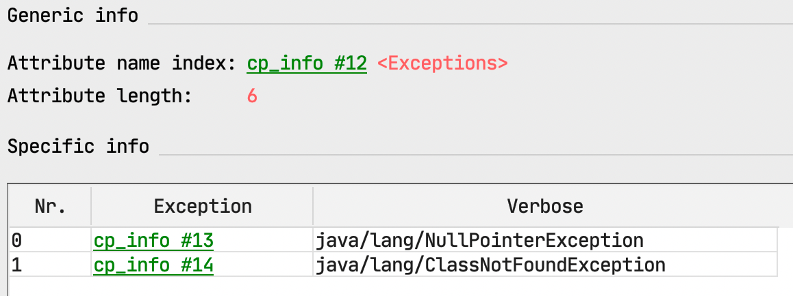

众所周知，字节码是Java虚拟机中非常重要的一部分，通过了解字节码我们也可以Java中语法的实现，如异常处理的逻辑、以及同步代码块的实现方式。
下面将会从中抽取一些示例，结合字节码的方式看看从ByteCode的角度去了解Java语法的实现逻辑。
<!--more-->

## 1、异常捕获的实现方式

### 1.1 异常 catch 的实现方式

在日常的开发中，我们经常使用异常捕获来处理一些异常信息，如果从字节码的角度来看，笔者发现了一些更加细致的方式，在开始之前我们来提出问题：

1. catch是如何捕获异常信息的？
1. finally 是如何实现的？


为了解决这些问题，笔者这里写了一个非常简单的代码，如下:


```java
public void test() throws FileNotFoundException, ClassNotFoundException {
  try {
    File file = new File("/tmp/test.data");
    FileInputStream fileInputStream = new FileInputStream(file);
    fileInputStream.close();
  } catch (IOException e) {
    throw new RuntimeException(e);
  } finally {
    System.out.println("ExceptionTable.test");
  }
}
```

这个代码主要用一个test() 方法，方法的签名中抛出一个运行时异常和非运行时异常，方法内部使用了try_catch_finally 的语法结构，虽然代码结构非常简单，但这足以说明一些问题。使用JclassLib 插件来查看异常test方法的字节码中Code属性信息如下:

从1-22 标识程序正常执行的流程，我们可以看到跳转到36行执行到return指令，从26-35行是catch的处理流程，那么程序如果在0-20行出现异常了，该如何对应到不同catch去执行呢？
test() 方法源码的Code属性中，也提供了**`异常表(Exception Table)`**, 本实例中源码的异常表如下：

异常表标识的含义如下:
 **如果在 [startPC] 到 [endPC] 中如果捕获到 [Catch Type] 类型的异常信息，那么就跳转到 [Handler PC] 出去执行，这就是异常捕获的实现方式**_和Code属性同级别的Exception 属性则标记了方法签名中抛出异常，若该异常为**_ _RuntimeException OR 其子类_ _**也仍然会被记录到Exception 属性记录中。



### 1.2 异常 finally 的实现方式

如果代码中加入了finally代码，那么是如何实现每个catch均执行的呢？下面写了一个简单的代码以及其字节码助记符如下:

```java
try {
  System.out.println(1);
} catch (RuntimeException e) {
  System.out.println(2);
} finally {
  System.out.println(123);
}
```
   

使用JclassLib 插件来查看异常test方法的字节码中Code属性信息如下,**可以非常明显的看到，finally 的代码块被复制了3份，分别放到了_try{}_ 代码区域，以及两个_catch{}_ 代码区域，这就是finally 的实现方式.**

```sql
 0 getstatic #2 <java/lang/System.out>
 3 iconst_1
 4 invokevirtual #3 <java/io/PrintStream.println>
 
 -- 正常执行完成，然后执行的 finally的代码 
 7 getstatic #2 <java/lang/System.out>
10 bipush 123
12 invokevirtual #3 <java/io/PrintStream.println>

15 goto 48 (+33)
18 astore_1
19 getstatic #2 <java/lang/System.out>
22 iconst_2
23 invokevirtual #3 <java/io/PrintStream.println>

-- 进入catach 执行的代码, 然后执行的 finally的代码 
26 getstatic #2 <java/lang/System.out>
29 bipush 123
31 invokevirtual #3 <java/io/PrintStream.println>

34 goto 48 (+14)
37 astore_2

-- 进入异常处理执行代码,然后执行的 finally的代码  
38 getstatic #2 <java/lang/System.out>
41 bipush 123
43 invokevirtual #3 <java/io/PrintStream.println>

46 aload_2
47 athrow
48 return
```


<a name="JlZpu"></a>
## 2、 Synchronized 的实现方式
Java代码中 synrochronized的实现方式主要是: monitorenter 以及 monitorexit 指令，分别用于监视器进入和监视器退出，下面分别写一些简单的代码看一下字节码中 synchronized 的实现方式与区别。

<a name="fD61g"></a>
### 2.1 方法签名中的 synchronized
_synchronized 可以修饰方法，比如下面的代码中,
```java
public  synchronized void test() {
  System.out.println(1);
}

public synchronized void test2(){}
```
我们使用 `javap -v xxxx.class` 命令查看方法的修饰符，可以看到方法的访问访问标记为 `ACC_PUBLI`、`ACC_SYNCHRONIZED` 其中我们比较关注的是后者，所以可知使用 Synchronized 修饰方法实现同步的原因是使用了访问标记  `ACC_SYNCHRONIZED`
```java
public synchronized void test();
    descriptor: ()V
    flags: ACC_PUBLIC, ACC_SYNCHRONIZED
    Code: ... // 省略 code 属性

 public synchronized void test2();
   descriptor: ()V
   flags: ACC_PUBLIC, ACC_SYNCHRONIZED
   Code: ... // 省略 code 属性
```

_
<a name="TUMD3"></a>
### 2.2 代码中的 synchronized

synchronized的参数是当前实例的 this对象，我们看一下`lock()` 方法的code属性
```java
  public void lock() {
    synchronized (this) {
      System.out.println(1);
    }
  }
```
_可以看到，在第3行的代码中使用指令 `monitorenter` 进入了当前实例的this的监视器,第12行使用指令 `monitorexit` 退出了了监视器，符合我们的预期，但是比较意外的是在18行又使用`monitorexit` 退出了一次，这是因为JVM为了防止程序出现异常，无法退出监视器，所以在整个synchronized代码块中使用了异常处理，在代码块出现异常的时候，也能保证能够释放监视器。N
```bash
 0 aload_0
 1 dup
 2 astore_1
 
 3 monitorenter   -- 使用 monitorenter 指令进入this的监视器
 4 getstatic #2 <java/lang/System.out>
 7 iconst_1
 8 invokevirtual #3 <java/io/PrintStream.println>
11 aload_1
12 monitorexit 		-- 使用 monitorexit 指令退出this的监视器
13 goto 21 (+8)

16 astore_2
17 aload_1
18 monitorexit 	 -- 使用 monitorexit 指令退出this的监视器 
19 aload_2
20 athrow
21 return
```
